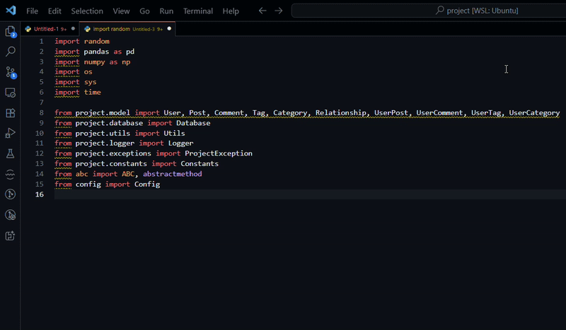

# 🐍 Python Lint Fixer

[](https://marketplace.visualstudio.com/items?itemName=pratik_mandge.python-lint-fixer)
[](LICENSE)
[](https://code.visualstudio.com/)

A comprehensive Python linting and formatting extension for Visual Studio Code that enforces consistent code style and automatically fixes common issues.

[](python-lint-fixer-extension.gif)

## ✨ Features

### 🎯 **Smart Import Organization**
- **System → External → Project** import grouping
- Automatic sorting and deduplication
- Proper spacing between import groups
- Multi-line import support with parentheses

### 🔧 **Code Formatting**
- **Quote standardization** (double to single quotes)
- **Line length management** (85 characters with smart wrapping)
- **Function/class formatting** with proper indentation
- **Spacing rules** (2 lines before classes, 1 line before methods)

### 🚀 **Real-time Linting**
- **Green highlighting** for issues in the editor
- **Hover messages** with detailed explanations
- **Problems panel** integration
- **Auto-fix on save** (configurable)

### 🎨 **User Experience**
- **Status bar button** for quick access
- **Keyboard shortcuts** (`Ctrl+Shift+Q`)
- **Context menu** integration
- **Progress indicators** during formatting

## 🚀 Quick Start

### Installation

1. **Download the VSIX file** from releases
2. **Install in VS Code:**
   ```bash
   code --install-extension python-lint-fixer-0.1.0.vsix
   ```
3. **Reload VS Code** and open a Python file
4. **Click the lightbulb button** in the status bar or press `Ctrl+Shift+Q`

### Usage
Before:
```python
import random,math
def generate_values():
    for i in range(0,10):print(i*random.random())
class Dummy:pass
```

After:
```python
import math
import random


def generate_values():
    for i in range(0, 10):
        print(i * random.random())


class Dummy:
    pass
```

## 🎯 Error Codes

| Code | Description | Auto-fixable |
|------|-------------|--------------|
| PLF001 | Line exceeds maximum length | ✅ |
| PLF002 | Use single quotes instead of double quotes | ✅ |
| PLF003 | Multiple imports should be on separate lines | ✅ |
| PLF004 | Classes should be preceded by 2 blank lines | ✅ |
| PLF005 | Methods should be preceded by 1 blank line | ✅ |
| PLF006 | File should end with a blank line | ✅ |
| PLF007 | Import groups should be separated by at least 1 blank line | ✅ |

## 🔧 Commands

- **`python-lint-fixer.fixFile`** - Fix current Python file
- **`python-lint-fixer.fixWorkspace`** - Fix all Python files in workspace

## ⌨️ Keyboard Shortcuts

- **`Ctrl+Shift+Q`** - Fix current Python file (when Python file is active)

## 🎨 Import Organization Rules

### System Imports
```python
import os
import sys
from datetime import datetime
```

### External Libraries
```python
import django
import requests
from flask import Flask
```

### Project Imports (grouped by app)
```python
from users.models import User
from users.views import UserView

from project.models import Project
from project.handlers import ProjectHandler
```

## 🛠️ Development

### Prerequisites
- Node.js (v14 or higher)
- npm
- VS Code

### Building from Source

1. **Clone the repository:**
   ```bash
   git clone <repository-url>
   cd python-lint-fixer
   ```

2. **Install dependencies:**
   ```bash
   npm install
   ```

3. **Compile the extension:**
   ```bash
   npm run compile
   ```

4. **Package the extension:**
   ```bash
   npx vsce package
   ```

5. **Install the extension:**
   ```bash
   code --install-extension python-lint-fixer-0.1.0.vsix
   ```

### Project Structure

```
python-lint-fixer/
├── src/
│   ├── extension.ts          # Main extension entry point
│   ├── pythonLinter.ts       # Linting logic and diagnostics
│   └── pythonFormatter.ts    # Auto-fixing functionality
├── test/                     # Test files
├── logo.svg                  # Extension logo
├── package.json              # Extension manifest
├── README.md                 # This file
└── LICENSE                   # MIT License
```

## 🤝 Contributing

1. Fork the repository
2. Create a feature branch (`git checkout -b feature/amazing-feature`)
3. Commit your changes (`git commit -m 'Add amazing feature'`)
4. Push to the branch (`git push origin feature/amazing-feature`)
5. Open a Pull Request

## 📝 License

This project is licensed under the MIT License - see the [LICENSE](LICENSE) file for details.

## 🙏 Acknowledgments

- Built with [VS Code Extension API](https://code.visualstudio.com/api)
- Inspired by Python community coding standards
- Follows [PEP 8](https://www.python.org/dev/peps/pep-0008/) guidelines

## 📞 Support

- **Issues:** [GitHub Issues](https://github.com/pratik-mandge/python-lint-fixer/issues)
- **Documentation:** [Wiki](https://github.com/pratik-mandge/python-lint-fixer/wiki)
- **Email:** pratikmandgebussiness@gmail.com

---

**Made with ❤️ by Pratik Mandge**
